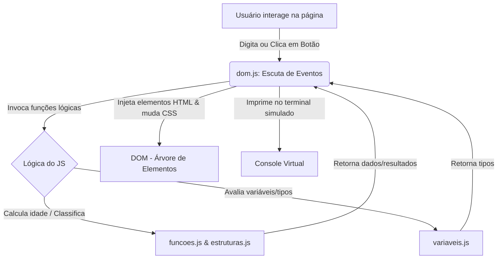

# Laboratório Interativo de Introdução ao JavaScript 🚀

Este projeto é um guia interativo e prático para o aprendizado de conceitos básicos de JavaScript (JS). Ele foi desenvolvido com um layout moderno e responsivo, oferecendo suporte a **Tema Claro (Light Mode)**, um **Console Virtual** integrado na própria página para visualização dos logs de execução e um **Visualizador de Código Fonte** para estudo imediato.

---

## 📂 Estrutura de Arquivos

O projeto está organizado da seguinte maneira:

```text
IntroducaoJavaScript/
├── index.html          # Interface principal do painel (Dashboard)
├── style.css           # Estilização visual (Tema Claro, CSS Grid/Flexbox e Animações)
├── README.md           # Manual de documentação do laboratório
└── js/                 # Pasta de scripts explicativos e lógicos
    ├── variaveis.js    # Exemplos de declaração de variáveis e tipos primitivos
    ├── funcoes.js      # Exemplos de funções tradicionais, expressões e Arrow Functions
    ├── estruturas.js   # Exemplos de if/else, switch, loop for/while e iteradores
    └── dom.js          # Escuta de eventos e manipulação em tempo real do DOM
```

---

## ⚙️ Fluxo de Funcionamento

O diagrama abaixo ilustra como a interação do usuário na página se conecta aos scripts de lógica para processar dados, manipular o DOM e reportar ações no console virtual:



---

## 📄 O que os scripts fazem e como funcionam

### 1. `js/variaveis.js`
* **O que faz:** Explica de forma comentada como o JavaScript declara e armazena informações em memória e expõe o estado dessas variáveis.
* **Como faz:**
  * Utiliza as palavras-chave `let` (escopo de bloco e reatribuível) e `const` (escopo de bloco e valor fixo não reatribuível).
  * Demonstra os tipos primitivos: `String`, `Number` (inteiros e decimais), `Boolean`, `Null` e `Undefined`.
  * Demonstra tipos complexos: `Array` (listas indexadas) e `Object` (chaves e valores).
  * Expõe a função `obterInfoVariaveis()` para que outros scripts descubram em tempo real a tipagem das variáveis.

### 2. `js/funcoes.js`
* **O que faz:** Contém exemplos de declaração e execução de sub-rotinas (blocos de código reutilizáveis).
* **Como faz:**
  * **Função Tradicional:** `function saudar(nome)` - possui *hoisting* (elevação sintática).
  * **Expressão de Função:** `const calcularIdade` - associada a variáveis para proteção de escopo.
  * **Arrow Function:** `const somar = (a, b) => a + b` - sintaxe moderna introduzida no ES6 com retorno implícito de linha única.

### 3. `js/estruturas.js`
* **O que faz:** Processa lógica condicional e fluxos de iteração repetitivos.
* **Como faz:**
  * Usa condicionais (`if`, `else if`, `else`) na função `classificarIdade(idade)` para classificar se o usuário é criança, adolescente, adulto ou idoso.
  * Usa a estrutura condicional `switch` em `traduzirCor(cor)` para mapeamento direto de chaves.
  * Usa o loop clássico `for` em `gerarSequenciaNumerica(limite)` para gerar um array de números sequenciais até o limite informado.
  * Usa o loop condicional `while` e o método funcional de array `forEach` para iterações alternativas.

### 4. `js/dom.js`
* **O que faz:** O "coração" interativo. Faz a ponte de controle entre os arquivos de exemplo anteriores e o arquivo visual `index.html`.
* **Como faz:**
  * **Escuta Eventos:** Usa `.addEventListener()` para capturar cliques de botões (`click`), envios de formulário (`submit`) e digitações em tempo real (`input`).
  * **Modifica Textos e Elementos:** Lê valores de inputs com `.value` e atualiza textos da página alterando a propriedade `.textContent` ou `.innerHTML`.
  * **Manipula Classes CSS:** Adiciona e remove classes de estilo usando `element.classList.add()` ou `element.classList.toggle()`.
  * **Cria e Remove Nós Dinamicamente:** Usa `document.createElement()` para gerar novos elementos filhos (`<li>` ou `<span>`), insere-os no documento com `appendChild()`, e remove-os com `node.remove()` após animações CSS.
  * **Console Virtual:** Intercepta as ações do usuário e mensagens do navegador e as imprime em uma caixa estilizada na tela da página com timestamps e cores indicativas (sucesso, erro, sistema).

---

## 🚀 Como usar o exemplo localmente

O laboratório funciona de forma 100% estática e nativa no navegador. Você não precisa instalar dependências complexas nem compilar o código.

### Opção 1: Abertura Direta (Mais simples)
1. Navegue até a pasta `IntroducaoJavaScript/`.
2. Dê dois cliques no arquivo **`index.html`** para abri-lo diretamente no seu navegador padrão.

### Opção 2: Servidor Local (Recomendado para evitar bloqueios do navegador)
Caso você queira rodar um servidor de desenvolvimento rápido para atualização em tempo real, execute no terminal a partir do diretório do projeto:

**Usando Node.js (se instalado):**
```bash
npx -y live-server
```
*ou*
```bash
npx -y http-server
```

**Usando Python:**
```bash
python3 -m http.server 8080
```
Depois, abra seu navegador em `http://localhost:8080`.

---

## 🕹️ Guia de Uso da Interface

Quando você abrir o painel, poderá explorar as seguintes áreas interativas:

1. **Painel de Variáveis (Card 1):** Digite seu nome e ano de nascimento. O JS calcula a sua idade (usando o script `funcoes.js`), classifica sua faixa etária (usando o script `estruturas.js`) e imprime no console e na tela o resultado acompanhado dos tipos de dados de cada variável (`string`, `number`).
2. **Painel de Funções (Card 2):** Mude os números A e B e clique em **Somar** ou **Multiplicar** para disparar arrow functions e ver o resultado impresso com destaque na tela e a chamada registrada nos logs do Console Virtual.
3. **Painel de Loops (Card 3):** Escolha uma quantidade de iterações (ex: 12) e clique em **Executar Loop**. O JavaScript executará um loop `for` e criará elementos de círculos animados dinamicamente. **Dica:** Clique nas bolinhas geradas para testar a ativação de classes CSS dinâmicas em elementos criados em tempo de execução.
4. **Laboratório do DOM (Card 4):**
   * Digite algo no input de texto e veja o título da caixa de visualização mudar em tempo real enquanto você digita.
   * Selecione um tema no menu *dropdown* para ver novas classes de temas HSL sendo injetadas na caixa.
   * Clique em **Alternar Efeito Glow** para ligar/desligar uma classe de sombra brilhante.
   * Escreva um item no input inferior e clique em **Adicionar** para injetar novos nós filhos de lista. Clique no botão **&times;** para removê-los com animações suaves de saída.
5. **Painel de Abas de Código (Visualizador):** Clique em `variaveis.js`, `funcoes.js`, `estruturas.js` ou `dom.js` na barra superior do visualizador de código para estudar diretamente os scripts fonte explicados e documentados.
6. **Console Virtual:** Acompanhe cada clique, erro intencional ou processo efetuado pelos scripts lendo as mensagens emitidas. Use o botão **Limpar** para resetar o log.
